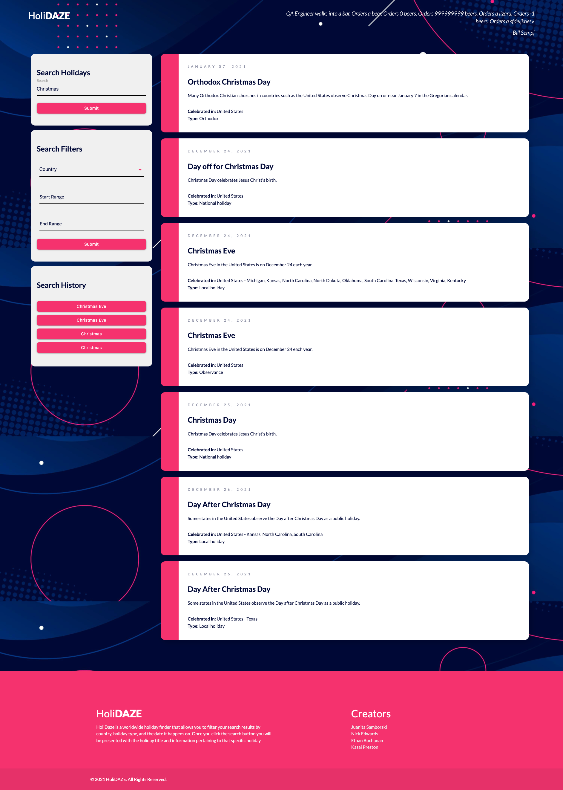

# HoliDAZE 

# Description

HoliDAZE is an application in which the user can search for a certain holiday with the option of filtering the results by country and date.

# Table of contents
* [Description](#description)
* [Usage](#usage)
* [Technologies](#technologies)
* [Demo](#demo)
* [Screenshot](#screenshot)

# Usage

Developers are often tasked with retrieving data from another application's API and using it in the context of their own. Third-party APIs allow developers to access their data and functionality by making requests with specific parameters to a URL. 

Once the user has typed in a specific holiday they are presented with information pertaining to that holiday. If the pop up box is clicked the user will be redirected to another page that contains more info on the searched holiday and in addition to that the user will be offered a random historic event that took place on the current day. 

# Technologies

* JavaScript

* JQUERY

* CSS

* HTML

* Materialize-CSS componets 

* API's used : 
  1. [Holiday data](https://calendarific.com/) : Access holiday data and print to page dynamically.
  2. [Random quote](http://quotes.stormconsultancy.co.uk/api) : Pulls random quote to be printed onto page.
  3. [Today in history](https://history.muffinlabs.com/) : Pulls a historic event on the current day in time.
  4. [Moment](https://momentjs.com/) : Captures and displays current year.
 

# The Preview

Here's a live screencast of HoliDAZE in action: 

https://www.loom.com/share/71921d352f2b4d0eb35b6392c6534795

###### Holiday Finder

###### Holiday Finder with Search Input Results

###### Holiday Finder with Filter Results

# Take a Look

GitHub: https://github.com/jsamborski310/Holidaze

GitHub Pages: https://jsamborski310.github.io/Holidaze/

